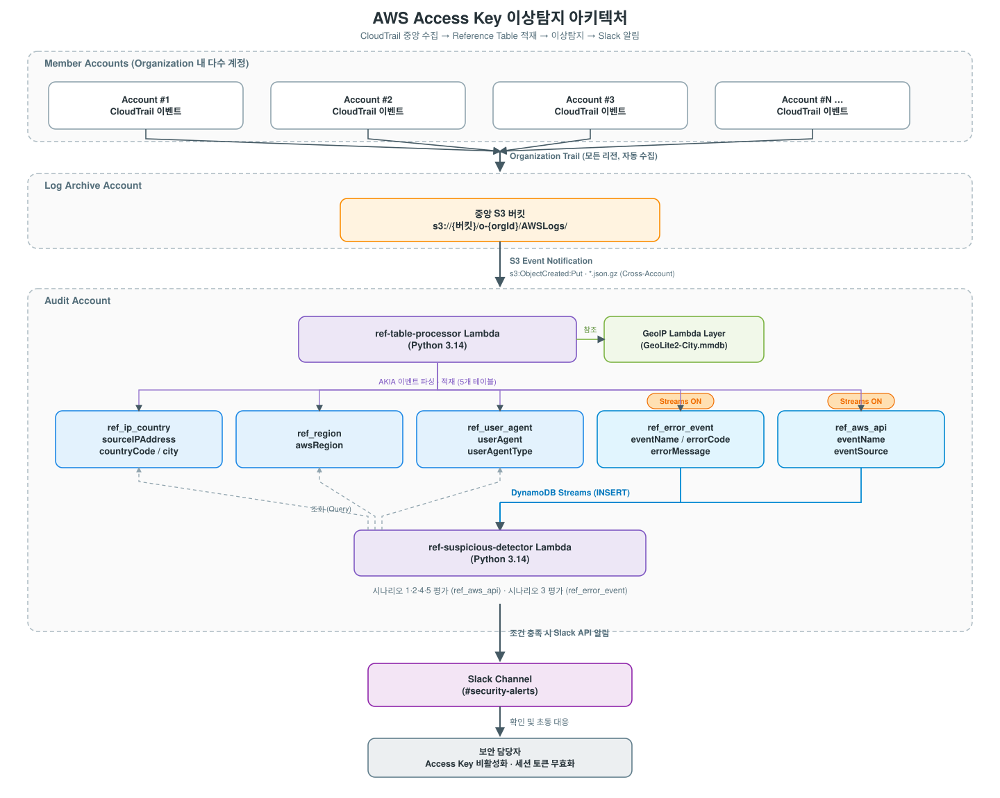
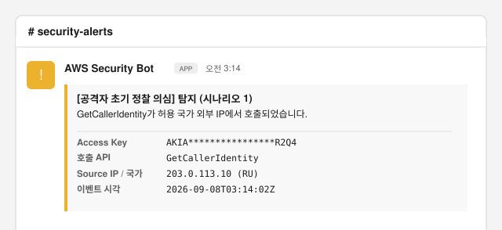
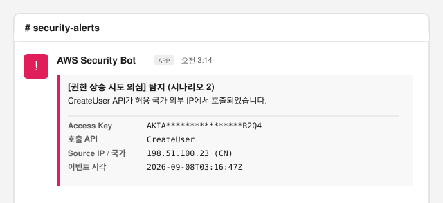
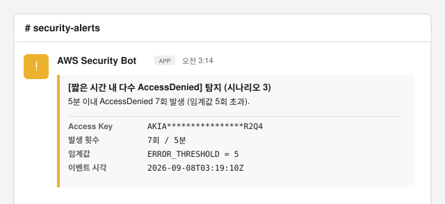
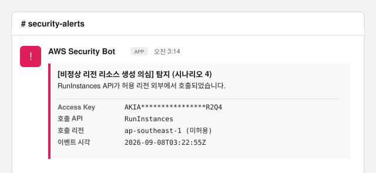
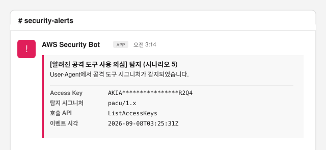

# AWS Access Key 이상탐지 아키텍처

## 1. 개요

### 1-1. 목적

본 아키텍처는 AWS IAM Access Key 유출 및 악용을 탐지하기 위해 구축되었습니다.

Access Key가 공격자에게 유출될 경우, 공격자는 이를 악용하여 AWS 환경에서 권한 탐색, 권한 상승, 백도어 생성 등의 행위를 수행할 수 있으며, 최종적으로 민감 정보 및 중요 데이터 유출과 같은 심각한 보안 사고를 초래할 수 있습니다.

이러한 위협에 대응하기 위해 CloudTrail 이벤트를 실시간으로 수집·분석하고, 사전 정의된 탐지 시나리오를 기반으로 이상 행위를 식별하여 보안 담당자에게 즉시 알림을 제공합니다. 이를 통해 Access Key 유출 이후 발생하는 악의적인 행위를 신속하게 인지하고 대응할 수 있도록 지원합니다.

또한 수집된 이벤트를 기반으로 Access Key별 활동 타임라인, 출발지 IP 및 국가, 호출 API, 대상 리전 등 다양한 컨텍스트 정보를 저장하여, 침해 의심 상황 발생 시 초기 공격 행위 분석과 사고 대응의 기초 자료로 활용할 수 있도록 구성하였습니다.

### 1-2. 아키텍처 구성도

아래 구성도는 CloudTrail 로그 중앙 수집부터 이상탐지 알림 발송까지의 전체 흐름을 나타냅니다.



### 1-3. 탐지 시나리오 목록

본 아키텍처는 5가지 시나리오를 기반으로 Access Key의 이상 행위를 탐지합니다.

| # | 제목 | 설명 |
|---|------|------|
| 1 | 공격자 초기 정찰 의심 | 공격자가 탈취한 Access Key의 유효성 확인 및 권한 파악을 위해 호출하는 정찰성 API가 허용 국가 외부에서 발생한 경우 탐지 |
| 2 | 권한 상승 시도 의심 | IAM 사용자 생성, 정책 연결 등 권한 상승 관련 API가 허용 국가 외부 IP에서 호출된 경우 탐지 |
| 3 | 짧은 시간 내 다수 AccessDenied | 동일 Access Key에서 설정된 시간 윈도우 내 AccessDenied가 임계값 이상 발생한 경우 탐지 |
| 4 | 비정상 리전 리소스 생성 의심 | EC2 인스턴스 생성 등 리소스 생성 API가 허용 리전 외부에서 호출된 경우 탐지 |
| 5 | 정체불명 도구로 민감 API 호출 | Unknown User Agent(공격 도구 시그니처)로 민감 API가 호출된 경우 탐지 |

## 2. 구성요소

### 2-1. CloudTrail 중앙 수집 (Log Archive)

본 아키텍처는 AWS Control Tower 환경에서 구현되었으며, Organization Trail을 통해 모든 멤버 계정의 CloudTrail 로그를 Log Archive 계정의 중앙 S3 버킷에 자동으로 수집합니다.

Control Tower가 기본적으로 Organization Trail을 구성하므로, 멤버 계정이 추가되거나 새로운 리전에서 API 호출이 발생하더라도 별도 설정 없이 자동으로 중앙 수집됩니다. 이를 통해 공격자가 어느 멤버 계정에서, 어느 리전에서 API를 호출하더라도 탐지 범위에서 누락되지 않도록 보장합니다.

Control Tower 환경이 아닌 단일 계정 환경에서도 콘솔에서 CloudTrail 추적 생성 시 "모든 리전에 적용" 옵션이 활성화되므로 멀티 리전 Trail이 구성되어, 모든 리전의 이벤트를 단일 S3 버킷에 중앙 수집할 수 있습니다. 이 경우에도 본 시스템의 탐지 범위에서 리전 누락 없이 동일하게 구성 가능합니다.

#### 주요 구성

- Trail 유형: Organization Trail (모든 리전 적용)
- 로그 저장 위치: Log Archive 계정 S3 버킷
- 로그 경로: `s3://{버킷명}/o-{orgId}/AWSLogs/`
- 수집 주기: 약 5분 (CloudTrail 배치 전송 주기)

#### S3 Event Notification 설정

Log Archive 계정 S3 버킷에 CloudTrail 로그 파일이 생성될 때마다 S3 Event Notification을 통해 Audit 계정의 Lambda 함수(`ref-table-processor`)를 트리거합니다.

- 접두사(Prefix): `o-{orgId}/AWSLogs/o-{orgId}/` (CloudTrail 이벤트가 저장되는 경로)
- 접미사: `.json.gz`
- 이벤트 유형: `s3:ObjectCreated:Put`
- 대상: Audit 계정 Lambda (S3와 Lambda 간 크로스 어카운트 접근 허용이 선행되어야 원활하게 진행이 가능합니다.)

### 2-2. Reference Table (DynamoDB)

Reference Table은 CloudTrail 이벤트에서 파싱한 컨텍스트 정보를 분석 목적에 따라 테이블별로 분리 저장하는 구조입니다. 각 테이블은 특정 관점의 정보를 담고 있으며, 공통 키를 기반으로 상호 연계하여 상관분석의 기반 데이터로 활용됩니다.

모든 테이블은 `AKIA`로 시작하는 IAM 사용자 Access Key 이벤트만을 대상으로 하며, `ref-table-processor` Lambda에 의해 자동으로 적재됩니다.

#### 공통 키 구조

모든 Reference Table(5종)에 동일하게 적용되는 키 구조입니다.

- PK(Partition Key): `accessKeyId`
- SK(Sort Key): `eventTime#eventId`

복합 SK를 사용하여 시간 기준 정렬 및 range 조회가 가능하고, 동일 시간대에 발생한 이벤트 간 충돌을 방지합니다.

#### 테이블 목록 및 스키마

| 테이블명 | 설명 | 필드 |
|---|---|---|
| `ref_ip_country` | Access Key 이벤트를 호출한 Source IP의 지리 정보를 저장 | `sourceIPAddress`, `countryCode`, `city` |
| `ref_region` | Access Key 이벤트가 호출된 대상 AWS 리전 정보를 저장 | `awsRegion` |
| `ref_user_agent` | Access Key 이벤트를 호출한 클라이언트의 User Agent 원본 및 유형을 저장 | `userAgent`, `userAgentType` |
| `ref_error_event` | Access Key 이벤트 중 `errorCode`가 발생한 이벤트의 오류 정보를 저장 | `eventName`, `errorCode`, `errorMessage` |
| `ref_aws_api` | Access Key가 호출한 AWS API의 이벤트명 및 서비스 정보를 저장 | `eventName`, `eventSource` |

#### TTL 설정

모든 테이블에 TTL(Time to Live) 기능을 활성화하여 데이터 보존 기간을 관리합니다. 각 항목 적재 시 현재 시각 기준 30일 후의 Unix timestamp를 `ttl` 필드에 저장하며, DynamoDB가 만료된 항목을 자동으로 삭제합니다. 이를 통해 불필요한 데이터 누적을 방지하고 스토리지 비용을 절감합니다.

### 2-3. 데이터 수집 파이프라인

데이터 수집 파이프라인은 CloudTrail 로그를 파싱하여 Reference Table에 저장하는 일련의 처리 과정입니다.

핵심 컴포넌트는 `ref-table-processor` Lambda 함수이며, Source IP의 지리 정보 식별을 위해 GeoIP Lambda Layer를 함께 활용합니다.

#### `ref-table-processor` (Python 3.14) 로직

1. S3에서 CloudTrail 로그 파일 다운로드 및 압축 해제
2. CloudTrail 이벤트 배열 순회
3. `userIdentity.accessKeyId`가 `AKIA`로 시작하는 이벤트만 필터링
4. 이벤트별 파싱 후 Reference Table 선택적 적재
   - `ref_error_event`: `errorCode`가 존재하는 이벤트만
   - `ref_ip_country`: `sourceIPAddress`가 `*.amazonaws.com`이 아닌 경우만
   - `ref_aws_api`: 모든 AKIA 이벤트
   - `ref_region`: 모든 AKIA 이벤트
   - `ref_user_agent`: 모든 AKIA 이벤트

#### GeoIP Lambda Layer

`ref_ip_country` 테이블에 Source IP의 국가(`countryCode`) 및 도시(`city`) 정보를 저장하기 위해서는 IP 주소를 지리 정보로 변환하는 조회 수단이 필요합니다.

IP 지리 정보를 조회하는 방법으로 RDAP(Registration Data Access Protocol)와 같은 인터넷 기반 프로토콜을 활용할 수 있습니다. 그러나 이 방식은 이벤트가 발생할 때마다 외부 인터넷으로의 아웃바운드 통신이 반복적으로 발생합니다.

이에 본 아키텍처에서는 MaxMind `GeoLite2-City.mmdb` 데이터베이스 파일을 Lambda Layer에 탑재하는 방식을 채택하였습니다. mmdb 파일을 Layer로 빌드하는 과정에서 한 차례 아웃바운드 통신이 발생하지만, 이후 Lambda 실행 시에는 Layer에 내장된 데이터베이스를 직접 참조하므로 이벤트 처리 시마다 발생하는 반복적인 외부 통신을 제거할 수 있습니다.

**Layer 구성**

- `GeoLite2-City.mmdb`: MaxMind에서 제공하는 IP 지리 정보 데이터베이스 파일로, 주기적인 업데이트 필요.
- `geoip2`, `maxminddb`: mmdb 파일을 Python에서 조회하기 위한 라이브러리.

### 2-4. 이상탐지 및 알림

`ref-suspicious-detector`는 Reference Table에 새로운 데이터가 적재될 때 DynamoDB Streams를 통해 트리거되며, 사전 정의된 탐지 시나리오에 따라 이상 행위를 식별하고 Slack 알림을 발송하는 Lambda 함수입니다.

#### DynamoDB Streams

DynamoDB Streams는 테이블에 데이터 변경(INSERT/UPDATE/DELETE)이 발생할 때 해당 변경 내용을 스트림으로 흘려보내는 기능입니다. 본 시스템에서는 Reference Table에 새로운 이벤트가 적재되는 즉시 `ref-suspicious-detector` Lambda를 트리거하기 위해 활용합니다.

**Streams 활성화 대상**

탐지 시나리오의 트리거 역할을 하는 테이블에만 Streams를 활성화합니다.

- `ref_aws_api`: 시나리오 1, 2, 4, 5의 트리거
- `ref_error_event`: 시나리오 3의 트리거

나머지 테이블은 트리거가 아닌 조회 대상이므로 Streams 활성화가 불필요합니다.

#### `ref-suspicious-detector` (Python 3.14) 로직

1. DynamoDB Streams에서 INSERT 이벤트 수신
2. 이벤트 소스 테이블 식별
   - `ref_aws_api`: 시나리오 1, 2, 4, 5 탐지
   - `ref_error_event`: 시나리오 3 탐지
3. 탐지 시나리오 조건 평가 (필요 시 `ref_ip_country`, `ref_region`, `ref_user_agent` 테이블 조회)
4. 조건 충족 시 Slack 알림 발송

#### Lambda 환경변수

탐지 시나리오 평가 기준은 Lambda 환경변수로 관리하며, 운영 환경에 따라 유연하게 조정할 수 있습니다.

| 변수명 | 설명 |
|---|---|
| `SLACK_CHANNEL_ID` | Slack 알림 수신 채널 |
| `ALLOWED_COUNTRIES` | 허용 국가코드 (콤마로 구분하여 입력, 예: `"KR, US"`) |
| `ALLOWED_REGIONS` | 허용 리전 (콤마로 구분하여 입력, 예: `"ap-northeast-2, us-east-1"`) |
| `ERROR_THRESHOLD` | 시나리오 3 AccessDenied 임계값 (기본값: 5) |
| `ERROR_WINDOW_MIN` | 시나리오 3 탐지 시간 윈도우 (기본값: 5분) |

#### Slack 알림 연동

탐지 시나리오 조건이 충족되면 `ref-suspicious-detector` Lambda가 Slack API를 활용하여 지정된 채널로 알림 메시지를 발송합니다.

## 3. 탐지 시나리오 상세

### 3-1. 시나리오 1 — 공격자 초기 정찰 의심

공격자가 탈취한 Access Key의 유효성 및 기본 정보를 확인하기 위해 가장 먼저 수행하는 행위 중 하나가 `GetCallerIdentity` API 호출입니다. 이 API는 현재 자격증명의 Account ID, ARN, 사용자 ID를 반환하며 별도의 IAM 권한 없이도 호출이 가능하다는 특성상 공격자의 초기 정찰 수단으로 자주 활용됩니다.

이후 공격자는 탈취한 키에 부여된 권한 범위를 파악하기 위해 `ListUserPolicies`, `ListAttachedUserPolicies` 등의 IAM 조회 API를 연속적으로 호출하는 경향이 있습니다.

본 시나리오는 위 API 호출이 허용 국가 외부 IP에서 발생한 경우를 탐지합니다.

**탐지 조건**

- Trigger: `ref_aws_api` 테이블에 INSERT 이벤트 발생
- Condition: `eventName = "GetCallerIdentity"` AND `countryCode NOT IN ALLOWED_COUNTRIES`
- Reference: `ref_ip_country` (`countryCode` 조회)

**모니터링 대상 API**

- `GetCallerIdentity`
- `ListUserPolicies`
- `ListAttachedUserPolicies`

**Python 코드 예시**

```python
if event_name == "GetCallerIdentity":
    ip_info = get_ip_country(access_key_id, sk)
    country_code = ip_info.get("countryCode", "")
    source_ip = ip_info.get("sourceIPAddress", "")
    is_foreign_ip = country_code and country_code not in ALLOWED_COUNTRIES

    if is_foreign_ip:
        alerts.append({
            "scenario": "시나리오 1",
            "title": "공격자 초기 정찰 의심",
            "detail": "GetCallerIdentity가 외부 IP에서 호출됨",
        })
```

**알림 예시**



*(실제 Slack 채널 캡처가 아닌, 알림 메시지 구성을 보여주기 위한 예시 이미지입니다.)*

### 3-2. 시나리오 2 — 권한 상승 시도 의심

Access Key 탈취 이후 공격자가 취하는 전형적인 후속 행위 중 하나는 권한 상승입니다. IAM 사용자 생성, 정책 연결, 그룹 추가 등 권한 관련 API를 호출하여 지속적인 접근 수단(백도어)을 확보하거나 더 높은 권한을 획득하려는 시도를 탐지합니다.

본 시나리오는 권한 상승 관련 API 호출이 허용 국가 외부 IP에서 발생한 경우를 탐지합니다.

**탐지 조건**

- Trigger: `ref_aws_api` 테이블에 INSERT 이벤트 발생
- Condition: `eventName IN PRIVILEGE_ESCALATION_APIS` AND `countryCode NOT IN ALLOWED_COUNTRIES`
- Reference: `ref_ip_country` (`countryCode` 조회)

**모니터링 대상 API**

- `CreateAccessKey`
- `AttachUserPolicy`
- `AttachRolePolicy`
- `PutUserPolicy`
- `PutRolePolicy`
- `AddUserToGroup`
- `CreateUser`

**Python 코드 예시**

```python
if event_name in PRIVILEGE_ESCALATION_APIS and is_foreign_ip:
    alerts.append({
        "scenario": "시나리오 2",
        "title": "권한 상승 시도 의심",
        "detail": f"{event_name} API가 외부 IP에서 호출됨",
    })
```

**알림 예시**



### 3-3. 시나리오 3 — 짧은 시간 내 다수 AccessDenied

공격자가 탈취한 Access Key로 허용되지 않은 API를 반복적으로 호출하거나, 권한 범위를 파악하기 위해 다양한 API를 시도하는 과정에서 다수의 `AccessDenied` 오류가 짧은 시간 내에 집중적으로 발생하는 경향이 있습니다. 이는 권한 탐색 또는 브루트포스 시도의 전형적인 패턴으로 볼 수 있습니다.

본 시나리오는 동일 Access Key에서 설정된 시간 윈도우 내에 `AccessDenied`가 임계값 이상 발생한 경우를 탐지합니다.

**탐지 조건**

- Trigger: `ref_error_event` 테이블에 INSERT 이벤트 발생
- Condition: 동일 `accessKeyId`로 `ERROR_WINDOW_MIN` 내 `errorCode` 발생 횟수 >= `ERROR_THRESHOLD`
- Reference: `ref_error_event` (시간 범위 내 동일 `accessKeyId` Query)

**Python 코드 예시**

```python
window_start = (
    datetime.fromisoformat(event_time.replace("Z", "+00:00"))
    - timedelta(minutes=ERROR_WINDOW_MIN)
).strftime("%Y-%m-%dT%H:%M:%SZ")

response = error_event_table.query(
    KeyConditionExpression=(
        boto3.dynamodb.conditions.Key("accessKeyId").eq(access_key_id)
        & boto3.dynamodb.conditions.Key("eventTime#eventId").between(
            window_start, sk
        )
    )
)

error_count = len(response.get("Items", []))

if error_count >= ERROR_THRESHOLD:
    send_slack_alert_scenario3(
        access_key_id=access_key_id,
        event_time=event_time,
        error_count=error_count,
    )
```

**알림 예시**



### 3-4. 시나리오 4 — 비정상 리전 리소스 생성 의심

공격자는 탈취한 Access Key를 이용해 백도어 인프라를 구축하거나 지속적인 접근 수단을 확보하기 위해 EC2 인스턴스 생성, Lambda 함수 생성 등 리소스 생성 API를 호출하는 경향이 있습니다. 특히 암호화폐 채굴을 목적으로 다수의 고사양 EC2 인스턴스를 생성하거나, 탐지를 우회하고 별도의 공격 거점을 마련하기 위해 평소 사용하지 않던 리전에서 리소스를 생성하는 사례가 실제 침해 사고에서 빈번하게 발생되고 있습니다.

본 시나리오는 리소스 생성 API가 허용 리전 외부에서 호출된 경우를 탐지합니다.

**탐지 조건**

- Trigger: `ref_aws_api` 테이블에 INSERT 이벤트 발생
- Condition: `eventName IN RESOURCE_CREATE_APIS` AND `awsRegion NOT IN ALLOWED_REGIONS`
- Reference: `ref_region` (동일 `accessKeyId`, `eventId`로 `awsRegion` 조회)

**모니터링 대상 API**

- `RunInstances`
- `CreateFunction`

**Python 코드 예시**

```python
if event_name in RESOURCE_CREATE_APIS:
    region_info = get_region(access_key_id, sk)
    aws_region = region_info.get("awsRegion", "")
    is_foreign_region = aws_region and aws_region not in ALLOWED_REGIONS

    if is_foreign_region:
        alerts.append({
            "scenario": "시나리오 4",
            "title": "비정상 리전 리소스 생성 의심",
            "detail": f"{event_name} API가 {aws_region} 리전에서 호출됨",
        })
```

**알림 예시**



### 3-5. 시나리오 5 — 정체불명 도구로 민감 API 호출

공격자는 탈취한 Access Key를 이용해 AWS 환경을 침해할 때 Pacu, WeirdAAL 등 AWS 환경 특화 공격 프레임워크를 활용하는 경우가 있습니다. 이러한 공격 도구들은 권한 열거, 권한 상승, 데이터 탈취 등의 기능을 자동화하여 제공하며, API 호출 시 UserAgent에 도구 고유의 시그니처 문자열을 포함하는 경향이 있습니다.

본 시나리오는 CloudTrail에 기록된 UserAgent 원본 값에서 알려진 공격 도구 시그니처가 감지된 경우를 탐지합니다. 단, UserAgent는 공격자 임의로 변경이 가능하므로 본 시나리오는 보조적인 탐지 수단으로 활용하는 것을 권장합니다.

**탐지 조건**

- Trigger: `ref_aws_api` 테이블에 INSERT 이벤트 발생
- Condition: `userAgent IN ATTACK_TOOL_SIGNATURES`
- Reference: `ref_user_agent` (동일 `accessKeyId`, `eventId`로 `userAgent` 조회)

**모니터링 대상 시그니처**

| 도구 | 설명 |
|---|---|
| Pacu | 대표적인 AWS 전용 침투 테스트 프레임워크로 메타데이터 조회, 권한 승격, 데이터 유출 등의 모듈을 제공 |
| aws_pwn | AWS 환경에서 권한 승격, 지속성(Persistence) 유지, 리소스 공격 등을 수행하는 공격 스크립트 모음 |
| weirdaal | 유출된 AWS Access Key가 어떤 서비스와 권한에 접근할 수 있는지 빠르게 확인하고 공격 경로를 탐색하는 오펜시브 라이브러리 |
| nimbostratus | AWS 인프라의 핑거프린팅, EC2 메타데이터 추출, 피보팅(Pivoting) 공격을 실험하는 도구 |
| cloud_enum | AWS, Azure, GCP 등 여러 클라우드에 노출된 퍼블릭 자원(S3 버킷, Azure Blob, Google Storage 등)을 자동으로 찾아내는 도구 |
| enumerate-iam | 탈취하거나 확보한 IAM 자격 증명(Access Key)으로 어떤 IAM 권한과 API 호출이 가능한지 빠르게 전수 조사하는 도구 |
| aws-recon | AWS 계정 내에 존재하는 리소스와 설정 상태를 인벤토리 형태로 빠르게 수집 및 정리해 주는 리콘(Reconnaissance) 도구 |

**Python 코드 예시**

```python
ua_info = get_user_agent(access_key_id, sk)
user_agent = ua_info.get("userAgent", "")

if any(sig in user_agent.lower() for sig in ATTACK_TOOL_SIGNATURES):
    alerts.append({
        "scenario": "시나리오 5",
        "title": "알려진 공격 도구 사용 의심",
        "detail": f"공격 도구 시그니처가 감지됨: {user_agent}",
    })
```

**알림 예시**



## 4. 알림 수신 시 대응 절차

### 4-1. Access Key 침해 의심 시 초동 조치

#### Access Key 비활성화

탐지된 Access Key를 즉시 비활성화하여 추가 피해를 차단합니다.

#### 세션 토큰 무효화

Access Key 비활성화 이후에도 이미 발급된 임시 세션 토큰은 만료 전까지 유효합니다. IAM 사용자에 아래 인라인 정책을 추가하여 활성 세션을 즉시 차단합니다.

```json
{
    "Version": "2012-10-17",
    "Statement": [
        {
            "Effect": "Deny",
            "Action": "*",
            "Resource": "*",
            "Condition": {
                "DateLessThan": {
                    "aws:TokenIssueTime": "2026-07-10T16:00:00Z"
                }
            }
        }
    ]
}
```

## 5. 운영 및 유지보수

### 5-1. 탐지 시나리오 임계값 조정

탐지 시나리오의 평가 기준은 `ref-suspicious-detector` Lambda 환경변수에서 관리하며, 운영 환경에 따라 유연하게 조정할 수 있습니다. false positive 발생 시 아래 환경변수를 수정합니다.

| 변수명 | 설명 |
|---|---|
| `SLACK_CHANNEL_ID` | Slack 알림 수신 채널 |
| `ALLOWED_COUNTRIES` | 허용 국가코드 (콤마로 구분하여 입력, 예: `"KR, US"`) |
| `ALLOWED_REGIONS` | 허용 리전 (콤마로 구분하여 입력, 예: `"ap-northeast-2, us-east-1"`) |
| `ERROR_THRESHOLD` | 시나리오 3 AccessDenied 임계값 (기본값: 5) |
| `ERROR_WINDOW_MIN` | 시나리오 3 탐지 시간 윈도우 (기본값: 5분) |

### 5-2. GeoIP DB 갱신

MaxMind `GeoLite2-City.mmdb`는 주기적으로 업데이트됩니다. IP 지리 정보의 정확도 유지를 위해 정기적으로 갱신하는 것을 권장합니다.

본 시스템에서는 mmdb 파일의 MD5 해시값을 비교하여 변경이 감지된 경우에만 신규 다운로드 및 Lambda Layer 재빌드를 수행하는 자동화 로직을 구성하였습니다. 불필요한 Layer 재빌드를 방지하고 갱신 작업을 효율화합니다.

**갱신 절차**

1. MaxMind에서 최신 `GeoLite2-City.mmdb` MD5 해시값 조회
2. 현재 Layer에 탑재된 mmdb 파일의 MD5 해시값과 비교
3. 해시값 일치 → 갱신 불필요, 종료 / 해시값 불일치 → 신규 mmdb 다운로드
4. Lambda Layer 재빌드 및 업로드
5. `ref-table-processor` Lambda에 새 Layer 버전 적용
