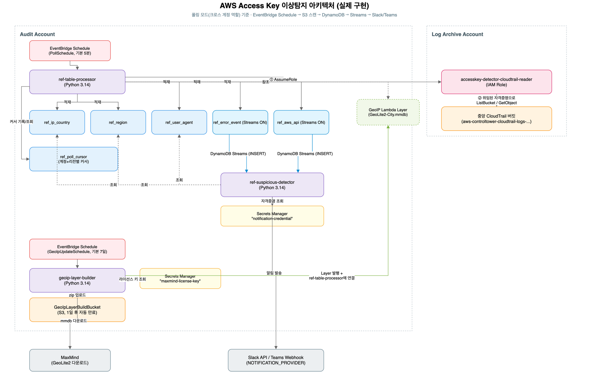

# AWS SAM 배포 가이드

이 문서는 [docs/architecture.md](architecture.md)에서 설명한 Access Key 이상탐지 아키텍처 중
**Audit 계정 구성요소**(3개 Lambda, DynamoDB Reference Table 5종, DynamoDB Streams, 알림 연동)를
AWS SAM CLI로 빌드·배포하는 방법을 처음부터 끝까지 안내합니다.

> 알림 채널은 Slack 또는 Microsoft Teams 중 선택할 수 있습니다(`NotificationProvider` 파라미터).
> 이 문서는 두 채널에 공통되는 빌드/배포 절차를 다루고, 채널별로 다른 사전 준비·파라미터 값·
> 트러블슈팅은 [docs/notifications/slack.md](notifications/slack.md) /
> [docs/notifications/teams.md](notifications/teams.md)에 각각 정리했습니다. 3단계(Secrets Manager
> 준비)와 5단계(배포 파라미터)를 진행하기 전에 사용할 채널의 문서를 먼저 읽어주세요.

## 사전 구성 체크리스트

아래 순서대로 진행하면 됩니다. 하나라도 빠뜨리면 배포는 성공해도 실제로는 동작하지 않는
경우가 많으니(권한 부족, 시크릿 이름 불일치 등), 처음이라면 순서를 건너뛰지 마세요.

| # | 해야 할 일 | 완료 기준 | 참고 절 |
|---|---|---|---|
| 1 | AWS CLI, SAM CLI 설치 및 자격증명 설정 | `aws sts get-caller-identity`, `sam --version`이 정상 출력 | 2-1 |
| 2 | 알림 채널 준비 (Slack Bot Token 또는 Teams Webhook URL 발급) | 토큰/URL을 손에 쥐고 있음 | 2-2, notifications/slack.md 또는 teams.md |
| 3 | MaxMind 계정 생성 및 GeoLite2 라이선스 키 발급 | 라이선스 키 문자열을 손에 쥐고 있음 | 2-3 |
| 4 | Secrets Manager에 시크릿 2개 생성 (알림 자격증명, MaxMind 라이선스) | `aws secretsmanager describe-secret`으로 둘 다 조회됨 | 3 |
| 5 | 중앙 CloudTrail 버킷 이름/소유 계정 ID 확인 | Log Archive 계정의 버킷 이름과 계정 ID를 손에 쥐고 있음 | 1-2 |
| 6 | `sam build && sam deploy --guided`로 첫 배포 | 스택 생성 완료(`CREATE_COMPLETE`) | 4, 5 |
| 7 | Log Archive 계정에 크로스 계정 IAM 역할 생성 | 역할에 `sts:AssumeRole` 신뢰 정책 + `s3:ListBucket`(버킷 자체 ARN) + `s3:GetObject`(`/*` ARN) 인라인 정책이 모두 있음 | 6 |
| 8 | `CrossAccountS3RoleArn` 파라미터 지정 후 재배포 | `ref-table-processor`가 폴링 모드로 동작 | 6 |
| 9 | `geoip-layer-builder` 최초 1회 수동 실행 | `ref-table-processor`에 GeoIP Layer가 연결됨 | 7 |
| 10 | 테스트용 IAM 사용자 + Access Key 발급 후 `scripts/alert_generator.sh` 실행 | DynamoDB에 데이터 적재 + Slack/Teams 알림 수신 | 8 |

## 0. 이 SAM 앱이 배포하는 범위

Control Tower / Organization Trail 자체는 조직 전체에 걸친 별도 설정이라 하나의 SAM 스택으로
만들 수 없습니다. 그래서 이 프로젝트는 **Audit 계정에서 관리하는 부분**을 SAM으로 구현합니다.



편집 가능한 원본은 [images/architecture.drawio](images/architecture.drawio)이며, [draw.io](https://app.diagrams.net)에서 열 수 있습니다. (`docs/architecture.md`의 구성도는 최초 설계 당시의 개념도이고, 이 다이어그램은 6절의 크로스 계정 역할 + 폴링 방식으로 실제 구현된 최종 모습을 반영합니다.)

| 리소스 | 설명 |
|---|---|
| `ref-table-processor` Lambda | EventBridge 스케줄로 주기 실행되며, 중앙 CloudTrail 버킷을 폴링해서 Reference Table 5종에 적재 |
| `ref-suspicious-detector` Lambda | DynamoDB Streams → 탐지 시나리오 평가 → Slack/Teams 알림 |
| `geoip-layer-builder` Lambda | MaxMind mmdb 갱신 확인 → Lambda Layer 재발행 → `ref-table-processor`에 자동 연결 (주기 실행) |
| DynamoDB 테이블 5종 | `ref_ip_country`, `ref_region`, `ref_user_agent`, `ref_error_event`, `ref_aws_api` |
| DynamoDB `ref_poll_cursor` 테이블 | (계정+리전)별 마지막 처리 위치를 저장해 다음 폴링에서 신규 파일만 가져오게 함 |

CloudTrail 로그는 **다른 계정(Log Archive)의 S3 버킷**에 쌓이므로, 그 버킷에서 이 스택의
Lambda가 데이터를 읽어올 수 있도록 하는 크로스 계정 설정이 별도로 필요합니다. 어떤 방식으로
연동하는지는 1-2절에서, 실제 설정 절차는 6절에서 다룹니다.

## 1. 프로젝트 구조

### 1-1. 디렉터리 구조

```
accesskey-claude-sam/
├── template.yaml                     # SAM 템플릿 (전체 인프라 정의)
├── src/
│   ├── ref_table_processor/
│   │   ├── app.py
│   │   ├── requirements.txt          # geoip2, maxminddb
│   │   └── Makefile                  # Docker 없이 빌드하기 위한 커스텀 빌드 스크립트
│   ├── suspicious_detector/
│   │   ├── app.py                    # 표준 라이브러리 + boto3만 사용
│   │   └── Makefile                  # 의존성 없음 — 소스 복사만 수행
│   └── geoip_layer_builder/
│       ├── app.py
│       ├── requirements.txt          # requests
│       └── Makefile
├── scripts/
│   └── alert_generator.sh            # 8절 동작 확인용 탐지 이벤트 발생 스크립트
├── events/                           # sam local invoke 대체 테스트용 샘플 이벤트
└── docs/
    ├── architecture.md
    ├── sam-deployment-guide.md       # 이 문서
    └── notifications/
        ├── slack.md
        └── teams.md
```

### 1-2. CloudTrail 연동 방식

이 스택은 **Organization Trail이 이미 구성되어 있고, CloudTrail 로그가 Log Archive 계정의
중앙 S3 버킷에 쌓이고 있다는 것을 전제**로 합니다 (Control Tower 환경이라면 기본적으로 이렇게
되어 있습니다). 버킷이 **다른 AWS 계정**에 있으므로 CloudFormation 스택 하나만으로는 양쪽을
다 설정할 수 없고, 이 프로젝트는 다음과 같은 방식으로 연동합니다.

- **버킷 정책은 건드리지 않습니다.** Control Tower 환경의 CloudTrail 버킷은 감사 로그 보호를
  위해 버킷 정책 변경이 SCP로 막혀있는 경우가 대부분이라, 애초에 그 방식은 선택지가 아닙니다.
- 대신 Log Archive 계정에 **크로스 계정 IAM 역할**을 하나 만들어두면, `ref-table-processor`가
  그 역할을 assume해서 마치 같은 계정에서 접근하는 것처럼 S3를 읽습니다.
- **S3 이벤트 알림도 쓰지 않습니다** (버킷에 알림을 등록하는 것도 같은 이유로 SCP에 막히는
  경우가 많습니다). 대신 EventBridge 스케줄(`PollSchedule`, 기본 5분)로 `ref-table-processor`가
  주기적으로 버킷을 직접 스캔(폴링)해서 새 로그 파일을 찾아옵니다.

```
Audit 계정 (EventBridge Schedule)
  → ref-table-processor Lambda
      → AssumeRole
        → Log Archive 계정의 크로스 계정 역할
          → S3 ListBucket / GetObject (같은 계정 접근으로 처리됨)
```

이 역할을 실제로 만들고 스택에 연결하는 절차는 6절에서 다룹니다. 지금은 이런 구조로
동작한다는 것만 이해하고 넘어가면 됩니다.

## 2. 사전 준비물

### 2-1. 도구 설치

```bash
# AWS CLI v2 (설치 여부 확인)
aws --version

# SAM CLI (설치 여부 확인)
sam --version
```

- AWS CLI가 없다면 [AWS 공식 설치 가이드](https://docs.aws.amazon.com/cli/latest/userguide/getting-started-install.html)를 참고하세요.
- SAM CLI가 없다면 [SAM CLI 설치 가이드](https://docs.aws.amazon.com/serverless-application-model/latest/developerguide/install-sam-cli.html)를 참고하세요. macOS는 `brew install aws-sam-cli`로도 설치할 수 있습니다.

```bash
aws configure
```

배포를 실행할 IAM 사용자/역할에는 최소한 다음 권한이 필요합니다: CloudFormation, Lambda, DynamoDB,
IAM(역할 생성), S3(SAM 배포용 버킷), EventBridge, Secrets Manager(읽기), CloudWatch Logs.

### 2-2. 알림 채널 준비 (Slack 또는 Teams)

사용할 채널에 맞는 문서를 먼저 진행해서 알림 자격 증명(Slack Bot Token 또는 Teams Webhook
URL)을 확보해두세요.

- Slack을 사용한다면 → [docs/notifications/slack.md](notifications/slack.md)
- Microsoft Teams를 사용한다면 → [docs/notifications/teams.md](notifications/teams.md)

### 2-3. MaxMind 계정 준비

1. [MaxMind](https://www.maxmind.com)에서 계정을 만들고 GeoLite2 라이선스 키를 발급받습니다.
2. 발급된 라이선스 키 문자열을 확보해둡니다.

## 3. 배포 전 준비: Secrets Manager 시크릿 생성

알림 자격 증명(Slack Bot Token 또는 Teams Webhook URL)과 MaxMind 라이선스 키는 절대
`template.yaml`이나 파라미터에 평문으로 넣지 않고, **미리 Secrets Manager에 직접 생성**합니다.

알림 채널용 시크릿 생성 명령은 채널마다 시크릿 값의 JSON 형태가 다르므로
[docs/notifications/slack.md](notifications/slack.md) 또는
[docs/notifications/teams.md](notifications/teams.md)의 "Secrets Manager 시크릿 생성" 절을
참고하세요. (시크릿 이름 기본값: `accesskey-detector/notification-credential`)

MaxMind 라이선스 키는 채널과 무관하게 공통으로 아래처럼 생성합니다.

```bash
aws secretsmanager create-secret \
  --name "accesskey-detector/maxmind-license-key" \
  --secret-string '{"MAXMIND_LICENSE_KEY":"여기에-실제-라이선스키"}'
```

시크릿 이름을 위 기본값과 다르게 만들었다면, 배포 시 `NotificationSecretName` /
`MaxMindSecretName` 파라미터로 **그 이름과 정확히 일치하는 값**을 지정하세요. 이 파라미터
값은 Lambda 환경변수뿐 아니라 IAM 정책의 Resource ARN 패턴(`secret:<이 값>-*`)에도 그대로
쓰입니다. 그래서 배포 이후 시크릿 이름을 바꿔야 한다면 **반드시 이 파라미터를 바꿔서
`sam deploy`로 재배포**해야 합니다 — Lambda 콘솔에서 환경변수만 직접 고치면 이름은
맞아떨어지지만 IAM 정책은 예전 값 그대로 남아있어서, `ResourceNotFoundException`이
`AccessDeniedException`으로 바뀔 뿐 여전히 실패합니다.

## 4. 빌드

프로젝트 루트(`template.yaml`이 있는 위치)에서 실행합니다. Docker는 필요하지 않습니다.

```bash
sam build
```

`template.yaml`에 이미 각 함수마다 `Metadata: BuildMethod: makefile`이 지정되어 있으므로,
`sam build`는 자동으로 `src/*/Makefile`을 실행해 의존성을 내려받습니다. 출력에
`Running CustomMakeBuilder:MakeBuild`가 보이면 이 방식으로 빌드되고 있는 것입니다.

빌드가 성공하면 `.aws-sam/build/`에 각 함수의 배포 패키지가 생성됩니다. `ref_table_processor`,
`geoip_layer_builder` 아래에 `geoip2`, `maxminddb`, `requests` 등 `requirements.txt`의
의존성이 (Linux x86_64용으로) 함께 패키징된 것을 확인할 수 있습니다.

```bash
file .aws-sam/build/RefTableProcessorFunction/maxminddb/*.so
# ELF 64-bit LSB shared object, x86-64 ... 로 나오면 정상 (macOS/Windows에서 빌드해도 Linux용 바이너리)
```

## 5. 배포

### 5-1. 처음 배포하는 경우

```bash
sam deploy --guided
```

대화형으로 아래 항목들을 물어봅니다. `ExistingCloudTrailBucketName`/`AccountId`는 이미 알고
있는 값이니 첫 배포 때 바로 채우면 되고, `CrossAccountS3RoleArn`만 6절에서 역할을 만든 뒤
채워서 한 번 더 재배포합니다.

| 항목 | 권장 값/설명 |
|---|---|
| Stack Name | 예: `accesskey-anomaly-detector` |
| AWS Region | 예: `ap-northeast-2` |
| Parameter Stage | `dev`, `prod` 등 환경 구분자 |
| Parameter NotificationProvider | `slack` 또는 `teams` |
| Parameter SlackChannelId | Slack 채널 ID (예: `C0123456789`). `NotificationProvider=teams`면 비워둠 |
| Parameter NotificationSecretName | 3단계에서 만든 알림 자격 증명 시크릿 이름과 **정확히 일치**해야 함 (기본값 그대로 만들었다면 그대로 써도 됨) |
| Parameter MaxMindSecretName | 3단계에서 만든 시크릿 이름과 **정확히 일치**해야 함 (기본값 그대로 만들었다면 그대로 써도 됨) |
| Parameter AllowedCountries | 허용 국가코드, 콤마 구분 (예: `KR`) |
| Parameter AllowedRegions | 허용 리전, 콤마 구분 (예: `ap-northeast-2`) |
| Parameter ErrorThreshold | 시나리오 3 임계값 (기본 5) |
| Parameter ErrorWindowMinutes | 시나리오 3 시간 윈도우(분) (기본 5) |
| Parameter GeoIpUpdateSchedule | GeoIP DB 갱신 주기 (기본 `rate(7 days)`) |
| Parameter DeployDemoCloudTrail | **`false`로 고정.** `true`(기본값)로 두면 이 스택이 쓰지도 않을 자체 데모용 S3 버킷과 CloudTrail을 추가로 만듭니다 |
| Parameter ExistingCloudTrailBucketName | Log Archive 계정의 중앙 CloudTrail 버킷 이름 |
| Parameter ExistingCloudTrailBucketAccountId | 그 버킷을 소유한 계정 ID (Log Archive 계정) |
| Parameter CrossAccountS3RoleArn | 처음 배포할 때는 비워두고, 6절에서 역할을 만든 뒤 재배포 시 지정. 지정하면 폴링 모드가 자동으로 켜짐 |
| Parameter PollSchedule | 버킷 스캔 주기 (기본 `rate(5 minutes)`) |
| Confirm changes before deploy | `Y` 권장 (변경 내용을 보고 승인) |
| Allow SAM CLI IAM role creation | `Y` (Lambda 실행 역할 등을 생성해야 함) |
| Disable rollback | `N` |
| Save arguments to configuration file | `Y` → 다음부터는 `sam deploy`만으로 재배포 가능 |

배포가 끝나면 `Outputs`에 함수 이름/ARN, 테이블 이름이 출력됩니다.

### 5-2. 이후 재배포

```bash
sam build && sam deploy
```

(`--guided`로 저장된 `samconfig.toml`을 그대로 사용합니다.)

## 6. 크로스 계정 설정

1-2절에서 설명한 대로, Log Archive 계정에 크로스 계정 IAM 역할을 만들고 그 ARN을 이 스택에
알려주는 절차입니다. 아래 작업은 계정이 서로 다르므로, 어느 계정 콘솔에서 진행하는지 각
단계마다 명시했습니다. 반드시 표시된 계정으로 콘솔 우측 상단에서 전환(스위치 롤/SSO 계정
변경)한 뒤 진행하세요.

### Audit 계정에서 (1) — Lambda 실행 역할 확인

**Lambda 콘솔** → 함수 목록에서 `ref-table-processor-<Stage값>` 클릭 → **Configuration(구성)**
탭 → **Permissions(권한)** → **Execution role(실행 역할)** 섹션에 표시된 역할 이름을 클릭하면
IAM 콘솔로 이동합니다. 그 페이지 상단의 **ARN**을 복사해둡니다. (뒤에서 Log Archive 쪽 신뢰
정책에 사용)

### Log Archive 계정에서 — 크로스 계정 역할 생성

**역할은 반드시 이 계정(버킷을 소유한 계정) 안에 만들어야 합니다.** Audit 계정에 만들면
동작하지 않습니다 — Audit 계정에 만든 역할은 Log Archive 계정 소속이 아니므로, 그 역할을
assume해도 여전히 "다른 계정에서 접근"하는 것이 되어 버킷 정책이 없으면 거부됩니다.

**1) 역할 생성**

**IAM 콘솔** → 왼쪽 메뉴 **Roles(역할)** → **Create role(역할 생성)**

- **Trusted entity type**: **Custom trust policy** 선택
- 아래 JSON 편집창에 기존 내용을 지우고 아래 내용을 붙여넣습니다. `Principal.AWS` 값은
  Audit 계정에서 복사해둔 Lambda 실행 역할 ARN으로 바꾸세요.

  ```json
  {
    "Version": "2012-10-17",
    "Statement": [
      {
        "Effect": "Allow",
        "Principal": {
          "AWS": "arn:aws:iam::<Audit계정ID>:role/<Lambda 실행 역할 이름>"
        },
        "Action": "sts:AssumeRole"
      }
    ]
  }
  ```

- **Next** → **Add permissions** 화면은 아무것도 선택하지 않고 그대로 **Next**
  (권한은 역할 생성 후 인라인 정책으로 따로 추가합니다)
- **Role name**: `accesskey-detector-cloudtrail-reader` 입력 → **Create role**

**2) 읽기 권한 추가**

폴링을 위해서는 객체를 읽는 `s3:GetObject`뿐 아니라 버킷 목록을 조회하는 `s3:ListBucket`도
필요합니다.

방금 만든 역할 페이지로 이동 → **Permissions(권한)** 탭 → **Add permissions** →
**Create inline policy**

- **JSON** 탭으로 전환 후 아래 내용을 붙여넣습니다. 버킷 이름을 실제 중앙 버킷 이름으로
  바꾸세요.

  ```json
  {
    "Version": "2012-10-17",
    "Statement": [
      {
        "Effect": "Allow",
        "Action": "s3:ListBucket",
        "Resource": "arn:aws:s3:::<중앙버킷이름>"
      },
      {
        "Effect": "Allow",
        "Action": "s3:GetObject",
        "Resource": "arn:aws:s3:::<중앙버킷이름>/*"
      }
    ]
  }
  ```

- **Next** → Policy name: `read-cloudtrail-logs` → **Create policy**
- 역할 페이지 상단의 **ARN**을 복사해둡니다 (Audit 계정 재배포에 필요).

이것으로 Log Archive 계정에서 할 일은 끝입니다. 이 버킷에는 그 외 어떤 설정도(버킷 정책,
이벤트 알림 등) 추가하지 않습니다.

### Audit 계정에서 (2) — 크로스 계정 역할 ARN 설정 후 재배포

Log Archive 계정에서 만든 역할의 ARN을 이 스택의 `CrossAccountS3RoleArn` 파라미터에
지정하면 끝입니다. Lambda 실행 역할에 `sts:AssumeRole` 권한을 붙이는 것, 환경변수
(`CROSS_ACCOUNT_S3_ROLE_ARN`, `POLL_BUCKET_NAME`)를 채우는 것, 폴링용 EventBridge
Schedule(`PollSchedule`)을 활성화하는 것까지 전부 템플릿이 자동으로 처리합니다 —
직접 건드릴 필요가 없습니다.

**1) samconfig.toml에 파라미터 값 반영**

프로젝트 루트의 `samconfig.toml`을 열어 `[default.deploy.parameters]`의
`parameter_overrides` 줄에서 `CrossAccountS3RoleArn` 값을 채우거나, 없다면 이어 붙입니다.

```toml
parameter_overrides = "Stage=\"dev\" ... CrossAccountS3RoleArn=\"arn:aws:iam::<LogArchive계정ID>:role/accesskey-detector-cloudtrail-reader\""
```

직접 파일을 고치는 대신 전체 파라미터를 대화형으로 다시 입력하고 싶다면
`sam deploy --guided`를 실행해도 됩니다 (이번엔 `CrossAccountS3RoleArn` 항목에 이 ARN을
입력).

**2) 재배포**

```bash
sam build && sam deploy
```

**3) 확인**

```bash
aws lambda get-function-configuration \
  --function-name ref-table-processor-<Stage값> \
  --query "Environment.Variables.{CrossAccountRole:CROSS_ACCOUNT_S3_ROLE_ARN,PollBucket:POLL_BUCKET_NAME}"
```

두 값이 채워져서 나오면 정상입니다. 이제 8-4절처럼 직접 invoke해서 실제 폴링이 되는지
확인하거나, `PollSchedule`(기본 5분)이 자동으로 돌기를 기다리면 됩니다.

## 7. 배포 후 필수 수동 단계: GeoIP Layer 최초 생성

`geoip-layer-builder`는 EventBridge 스케줄로 주기 실행되지만, **첫 배포 직후에는 Layer가 아직
없으므로 `ref-table-processor`가 GeoIP 조회 없이(국가/도시 정보 빈 값으로) 동작**합니다. 배포
직후 한 번은 수동으로 실행해서 Layer를 만들고 연결해주세요.

```bash
aws lambda invoke \
  --function-name geoip-layer-builder-<Stage값> \
  --cli-binary-format raw-in-base64-out \
  /tmp/geoip-layer-builder-output.json
cat /tmp/geoip-layer-builder-output.json
```

응답은 세 가지 중 하나입니다.

- `{"status": "updated", "layer_arn": "...", "hash": "..."}` — 성공. 새 Layer 버전을 발행하고
  `ref-table-processor`에 연결까지 마쳤습니다.
- `{"status": "skipped", "hash": "..."}` — MaxMind의 최신 해시가 이미 발행된 Layer의 해시와
  같아서(즉 이미 최신 상태라서) 아무것도 하지 않고 종료했습니다. 정상입니다.
- 그 외 에러 JSON (`errorMessage` 포함) — 실패. 흔한 원인은 아래와 같습니다.

| 에러 | 원인 / 해결 |
|---|---|
| `Secrets Manager` 관련 에러 (`ResourceNotFoundException`, `AccessDenied`) | `MaxMindSecretName`이 가리키는 시크릿이 없거나 값이 `{"MAXMIND_LICENSE_KEY": "..."}` 형식이 아님. 3절대로 시크릿을 다시 생성 |
| `403`/`401` (MaxMind 다운로드 URL 호출 시) | 라이선스 키가 잘못됐거나 만료됨. MaxMind 계정에서 재발급 |
| `NoSuchBucket`, `AccessDenied` (S3 업로드 관련) | `GeoIpLayerBuildBucket`이 스택에 정상적으로 생성됐는지 CloudFormation 콘솔에서 확인 |
| `ValueError: zip 크기(...)가 직접 업로드 한도(50MB)를 초과합니다` | 이전 버전 코드의 잔재입니다. `publish_layer()`는 이제 S3를 경유하도록 바뀌어 이 제한이 없습니다 — 이 에러가 보인다면 아직 옛 코드가 배포되어 있는 것이니 `sam build && sam deploy`로 다시 배포하세요. |

성공했다면 `ref-table-processor`의 설정을 확인해서 Layer가 붙었는지 확인할 수 있습니다.

```bash
aws lambda get-function-configuration \
  --function-name ref-table-processor-<Stage값> \
  --query "Layers"
```

Layer ARN이 하나 나오면(예: `arn:aws:lambda:<리전>:<계정ID>:layer:geoip-mmdb-<Stage값>:1`)
정상적으로 연결된 것입니다.

## 8. 동작 확인

이 섹션은 배포한 파이프라인이 실제로 끝까지(CloudTrail → S3 → `ref-table-processor` →
DynamoDB → Streams → `ref-suspicious-detector` → Slack/Teams) 동작하는지 검증하는 절차입니다.
[scripts/alert_generator.sh](../scripts/alert_generator.sh)로 시나리오 1·2·4·5에 해당하는
탐지 이벤트를 직접 발생시켜 확인합니다.

> **왜 굳이 테스트용 IAM 사용자를 새로 만들어야 하나요?**
> `ref-table-processor`는 `userIdentity.accessKeyId`가 `AKIA`로 시작하는 이벤트만
> 처리하도록 되어 있습니다 (실제 공격에 쓰이는 것도 이런 장기 IAM 사용자 Access Key이기
> 때문입니다). 그런데 여러분이 지금 AWS 콘솔에 로그인하거나 CLI를 쓸 때는 대부분 AWS
> SSO/IAM Identity Center를 통한 **임시 자격증명(Assumed Role)**을 쓰고 있을 텐데, 이 경우
> Access Key가 `ASIA`로 시작합니다. 즉 지금 로그인된 상태로 아무리 API를 호출해도
> `ref-table-processor`가 전부 걸러내므로 DynamoDB에는 절대 적재되지 않습니다. 그래서 테스트
> 때만 쓸 **장기 Access Key를 가진 IAM 사용자**를 별도로 하나 만들어야 합니다.

### 8-1. 테스트용 IAM 사용자 및 Access Key 준비

아래는 **관리자 권한이 있는 프로필**(SSO 등)로 실행합니다. 계정은 Organization Trail이
수집하는 계정이면 어디든 상관없습니다(보통 지금 SAM을 배포한 Audit 계정을 그대로 씁니다).

```bash
aws iam create-user --user-name accesskey-detector-test-user
aws iam create-access-key --user-name accesskey-detector-test-user
```

두 번째 명령의 출력에서 `AccessKeyId`(`AKIA...`)와 `SecretAccessKey` 값을 복사해둡니다.
이 값으로 **테스트 전용 프로필**을 하나 만듭니다 (지금 쓰고 있는 관리자 프로필을 덮어쓰지
않도록 반드시 이름을 지정하세요).

```bash
aws configure --profile akia-test
# AWS Access Key ID: 위에서 복사한 AccessKeyId (AKIA로 시작)
# AWS Secret Access Key: 위에서 복사한 SecretAccessKey
# Default region name: ap-northeast-2
# Default output format: json
```

확인:

```bash
aws sts get-caller-identity --profile akia-test
```

결과의 `Arn`에 `:user/accesskey-detector-test-user`가 보이면 준비가 끝난 것입니다.

> **`aws configure`를 프로필 이름 없이(`--profile` 없이) 실행하면 기본(default) 프로필
> 자체가 이 테스트 사용자로 바뀝니다.** 그러면 이후 `--profile` 없이 실행하는 다른 모든
> AWS CLI 명령(DynamoDB 조회, Lambda invoke 등)이 이 권한 없는 테스트 사용자로 실행되어
> 전부 `AccessDenied`가 납니다. 반드시 위처럼 `--profile akia-test`로 별도 프로필을
> 만드는 것을 권장합니다.

### 8-2. 테스트 스크립트로 탐지 이벤트 발생시키기

[scripts/alert_generator.sh](../scripts/alert_generator.sh)는 시나리오 1·2·4·5에 해당하는
API를 실제로 호출해주는 스크립트입니다. (시나리오 3은 `AccessDenied`를 반복 발생시켜야 해서
별도로 다룹니다 — 8-3절 참고)

```bash
chmod +x scripts/alert_generator.sh
./scripts/alert_generator.sh akia-test
```

인자로 넘긴 이름이 위에서 만든 프로필과 일치해야 합니다. (인자를 생략하면 **기본 프로필**을
씁니다 — 8-1절의 경고대로 기본 프로필이 진짜 테스트 사용자인 경우에만 그렇게 하세요.)

스크립트가 하는 일:

| 시나리오 | 스크립트가 호출하는 API | 비고 |
|---|---|---|
| 1. 초기 정찰 | `GetCallerIdentity`, `ListUserPolicies`, `ListAttachedUserPolicies` | |
| 2. 권한 상승 | `CreateUser`, `CreateAccessKey`, `AttachUserPolicy`, `PutUserPolicy`, `AddUserToGroup` (대상: `test-backdoor-user`) | 실제로 관리자 권한을 가진 백도어 사용자가 하나 생성됩니다 (8-7절에서 반드시 정리) |
| 4. 비정상 리전 리소스 생성 | `RunInstances`, `CreateFunction` (오사카 `ap-northeast-3` 리전) | 일부러 잘못된 파라미터(가짜 AMI ID 등)를 써서 실제로 리소스가 생성되지는 않지만, API 호출 자체는 CloudTrail에 정상 기록됩니다 |
| 5. 공격 도구 시그니처 | User-Agent에 `pacu/1.0`을 넣은 `GetCallerIdentity` | boto3로 직접 호출 |

> 8-1절대로 `accesskey-detector-test-user`에 아무 권한도 붙이지 않았다면, 위 표의 IAM/EC2/Lambda
> 호출들은 대부분 `AccessDenied`로 실패합니다. **탐지 테스트 목적으로는 이래도 상관없습니다** —
> CloudTrail은 성공/실패와 무관하게 API 호출 자체(`eventName`, `errorCode` 포함)를 기록하고,
> `ref-suspicious-detector`의 판단 로직도 호출 성공 여부를 보지 않기 때문입니다. 다만 이 경우
> 시나리오 2의 `test-backdoor-user`는 실제로 생성되지 않으므로 8-7절의 정리 명령은 그냥
> "지울 대상 없음"으로 끝납니다. (`test-backdoor-user`가 실제로 만들어지는 것까지 보고 싶다면
> `accesskey-detector-test-user`에 `IAMFullAccess` 같은 넓은 권한을 임시로 붙이면 되지만,
> 이는 실제로 위험한 권한을 부여하는 것이므로 신중히 판단하세요.)

### 8-3. (선택) 시나리오 3 — 짧은 시간 내 다수 AccessDenied

권한이 없는 API를 반복 호출해서 인위적으로 발생시킵니다. 같은 `akia-test` 프로필로:

```bash
for i in $(seq 1 6); do
  aws s3 ls s3://this-bucket-does-not-exist-and-should-be-denied --profile akia-test 2>/dev/null
done
```

`ERROR_THRESHOLD`(기본 5) 이상의 `AccessDenied`가 `ERROR_WINDOW_MIN`(기본 5분) 안에 쌓이면
알림이 발생합니다.

### 8-4. 바로 확인하고 싶다면 강제로 한 번 실행

`PollSchedule`(기본 5분) 주기와 CloudTrail 배치 전송(~5분)을 기다리지 않고 빨리 확인하려면,
몇 분 뒤 `ref-table-processor`를 직접 한 번 호출해봅니다.

```bash
aws lambda invoke \
  --function-name ref-table-processor-<Stage값> \
  --cli-binary-format raw-in-base64-out \
  --payload '{}' \
  /tmp/poll-output.json
```

계정/리전이 많은 조직이라면 한 번의 호출로 전체를 다 못 돌 수 있습니다 — 몇 번 더
실행하거나 스케줄이 몇 차례 더 도는 것을 기다려주세요. `ref_poll_cursor-<Stage값>` 테이블의
`__resume_after__` 항목으로 지금 어디까지 돌았는지 확인할 수 있습니다.

```bash
aws dynamodb get-item --table-name ref_poll_cursor-<Stage값> --key '{"prefix":{"S":"__resume_after__"}}'
```

### 8-5. DynamoDB에 적재됐는지 확인

```bash
aws dynamodb scan --table-name ref_aws_api-<Stage값> --max-items 10
aws dynamodb scan --table-name ref_error_event-<Stage값> --max-items 10
```

`GetCallerIdentity`, `CreateUser`, `RunInstances` 같은 `eventName`이 보이면 파이프라인
앞단(S3 → `ref-table-processor` → DynamoDB)이 정상 동작하는 것입니다. 아직 안 보인다면
CloudWatch Logs부터 확인하세요.

```bash
sam logs -n ref-table-processor-<Stage값> --stack-name <스택이름> --tail
```

### 8-6. Slack/Teams 알림 확인

```bash
sam logs -n ref-suspicious-detector-<Stage값> --stack-name <스택이름> --tail
```

- **시나리오 4, 5**는 발신 국가와 무관하므로, DynamoDB에 데이터가 쌓이면 잠시 후 Slack/Teams로
  바로 알림이 와야 합니다.
- **시나리오 1, 2**는 `is_foreign_ip`(허용 국가 외부 IP) 조건이 있습니다. 한국(또는
  `ALLOWED_COUNTRIES`에 포함된 국가)에서 스크립트를 실행했다면 DynamoDB에는 쌓이지만
  **알림은 오지 않는 것이 정상입니다.** 알림까지 확인하려면 해외 IP(VPN 등)로 실행하거나,
  테스트 동안만 `ALLOWED_COUNTRIES`를 실제 발신 국가와 다른 값으로 바꿔서 재배포한 뒤
  다시 시도하고, 확인 후 반드시 원래 값으로 되돌려서 재배포하세요.
- **시나리오 3**은 국가와 무관하게 임계값만 넘으면 알림이 옵니다.

채널별 세부 트러블슈팅은 [docs/notifications/slack.md](notifications/slack.md) /
[docs/notifications/teams.md](notifications/teams.md)를 참고하세요.

### 8-7. (필수) 테스트 자원 정리

테스트가 끝나면 **반드시** 아래 자원을 정리하세요. 8-2절 안내대로 `accesskey-detector-test-user`에
아무 권한도 안 붙였다면 `test-backdoor-user`는 애초에 생성되지 않았을 것이므로 첫 블록은
"삭제할 대상 없음"으로 끝나도 정상입니다 — 만약 넓은 권한을 임시로 부여해서 실제로
`test-backdoor-user`가 만들어졌다면 `AdministratorAccess`가 붙은 채로 남아있는 진짜 위험
요소이니 꼭 정리하세요. **아래 명령은 모두 관리자 프로필로 실행합니다** (`test-backdoor-user`
정리도 마찬가지입니다 — `accesskey-detector-test-user` 자신에게는 기본적으로 다른 IAM 사용자를
지울 권한이 없습니다).

```bash
# 시나리오 2에서 생성된 백도어 사용자 정리 (먼저 Access Key/정책을 떼어내야 사용자 삭제가 됨)
aws iam list-access-keys --user-name test-backdoor-user \
  --query "AccessKeyMetadata[].AccessKeyId" --output text \
  | xargs -n1 -I{} aws iam delete-access-key --user-name test-backdoor-user --access-key-id {}
aws iam detach-user-policy --user-name test-backdoor-user --policy-arn arn:aws:iam::aws:policy/AdministratorAccess
aws iam delete-user-policy --user-name test-backdoor-user --policy-name test-policy
aws iam delete-user --user-name test-backdoor-user

# 테스트용 IAM 사용자 자신도 정리
aws iam list-access-keys --user-name accesskey-detector-test-user \
  --query "AccessKeyMetadata[].AccessKeyId" --output text \
  | xargs -n1 -I{} aws iam delete-access-key --user-name accesskey-detector-test-user --access-key-id {}
aws iam delete-user --user-name accesskey-detector-test-user
```

## 9. 스택 삭제

```bash
sam delete
```

삭제 시 주의할 점:

- DynamoDB 테이블은 삭제되며 **누적된 탐지 데이터도 함께 사라집니다.**
- `geoip-layer-builder`가 발행한 Lambda Layer(`geoip-mmdb-<Stage값>`)는 CloudFormation이 관리하지
  않으므로(동적으로 발행되었기 때문에) 스택을 삭제해도 남아있습니다. 필요 없다면 별도로 정리하세요.

  ```bash
  aws lambda list-layer-versions --layer-name geoip-mmdb-<Stage값>
  aws lambda delete-layer-version --layer-name geoip-mmdb-<Stage값> --version-number <버전번호>
  ```

## 10. 트러블슈팅

| 증상 | 원인 / 해결 |
|---|---|
| `sam deploy` 시 `Unable to upload artifact ...: S3 Bucket does not exist` (관리형 버킷 재사용 시 재시도해도 반복됨) | `aws-sam-cli-managed-default` 스택을 지웠다가 다시 배포하는 등, 관리형 S3 버킷이 새로 만들어진 직후에 로컬 `samconfig.toml`이 예전 상태를 캐싱하고 있어서 생깁니다. `rm samconfig.toml` 후 `sam deploy --guided`로 파라미터를 처음부터 다시 입력하면 해결됩니다 (5-1절 참고) |
| `sam build` 시 `make: pip: command not found` 또는 `python3: command not found` | 빌드 머신에 `make` 또는 `python3`/`pip`이 없음. macOS는 Xcode Command Line Tools(`xcode-select --install`)로 `make`를, Linux는 배포판 패키지 매니저로 `python3`/`python3-pip`을 설치 |
| `sam build` 시 pip이 wheel을 못 받아옴 (타임아웃, `Could not find a version`) | 사내 네트워크에서 `pypi.org` 접속이 막혀있을 가능성. `pip.conf`/`PIP_INDEX_URL`로 사내 PyPI 미러를 가리키도록 설정하고, 그 미러에 `manylinux2014_x86_64`/`cp314` wheel이 있는지 확인 |
| 배포 시 `Unsupported runtime` 오류 | 해당 리전에 아직 `python3.14` Lambda 런타임이 제공되지 않음. `template.yaml`의 Runtime과 각 Makefile의 `PY_VERSION`/`PY_ABI`를 함께 `python3.13`/`3.13`/`cp313`으로 낮춰서 재배포 |
| `ref-table-processor`가 실행은 되는데 새 파일을 못 찾음 | EventBridge 규칙(`PollSchedule`)이 활성화되어 있는지, CloudWatch Logs에서 `poll_bucket_for_new_logs` 관련 에러(권한 부족 등)가 있는지 확인 |
| `ref-table-processor` 로그에 `[폴링] AWSLogs 루트 0개 발견`만 찍히고 실행 시간이 100ms 미만으로 매우 짧음 | 버킷의 실제 최상위 구조가 `AWSLogs/`도 `<OrgId>/AWSLogs/`도 아닌 경우입니다. S3 콘솔에서 버킷 루트 폴더 구조를 직접 확인하고, `find_awslogs_prefixes()`의 `depth` 상한(현재 2단계)을 늘려야 할 수도 있습니다 |
| "총 N개 이벤트 파싱 시작" 로그는 찍히는데 원하는 계정의 데이터가 안 보임 | 조직에 계정/리전이 많으면 한 번의 폴링으로 전부 못 돌 수 있습니다. `ref_poll_cursor-<Stage값>` 테이블에서 `__resume_after__` 항목의 값을 확인해 지금 어디까지 순환했는지 보고, 몇 차례(스케줄 주기만큼) 더 기다리거나 강제로 여러 번 invoke 해보세요 |
| `AccessDenied` (`sts:AssumeRole`, `CrossAccountS3RoleArn` 사용 시) | Log Archive 계정 쪽 역할의 신뢰 정책(trust policy) Principal이 Audit 계정의 `RefTableProcessorFunctionRole` ARN과 정확히 일치하는지 확인 |
| `AccessDenied` (`s3:ListBucket`/`s3:GetObject`, 폴링 모드) | Log Archive 계정 역할의 인라인 정책을 콘솔로 수정하다가 `GetObject` statement를 중복으로 남기고 `ListBucket`을 빠뜨리는 실수가 잦습니다. `aws iam get-role-policy --role-name accesskey-detector-cloudtrail-reader --policy-name read-cloudtrail-logs`로 실제 서버에 저장된 내용을 직접 확인하세요 (콘솔 화면과 다를 수 있습니다) — `ListBucket`은 버킷 자체 ARN(`/*` 없음), `GetObject`는 `/*` 붙은 ARN이어야 합니다 |
| GeoIP 국가 정보가 계속 빈 값 | `geoip-layer-builder`를 최초 1회 수동 실행했는지, `ref-table-processor`에 Layer가 붙었는지 7단계로 확인 |
| 알림이 안 옴 | 채널별 트러블슈팅 표 참고: [slack.md](notifications/slack.md#6-트러블슈팅) / [teams.md](notifications/teams.md#7-트러블슈팅). 공통적으로 CloudWatch Logs에서 `ref-suspicious-detector`의 에러 로그부터 확인 |
| `ResourceNotFoundException` (Secrets Manager, `Secrets Manager can't find the specified secret`) | `NotificationSecretName`/`MaxMindSecretName` 파라미터 값이 실제 시크릿 이름과 정확히 다른지(오타, 접두사/접미사 누락 등) 확인. `aws secretsmanager list-secrets`로 실제 이름을 확인하세요 |
| `AccessDeniedException` (Secrets Manager, `GetSecretValue`) | 이름은 맞는데 권한이 없는 경우입니다. **Lambda 콘솔에서 환경변수만 직접 고쳤다면 이게 원인**일 가능성이 높습니다 — IAM 정책의 Resource ARN 패턴(`...secret:<파라미터 값>-*`)은 배포 당시 `NotificationSecretName`/`MaxMindSecretName` 파라미터 값 그대로 고정되어 있어서, 환경변수만 바꾼다고 같이 바뀌지 않습니다. 콘솔에서 역할에 인라인 정책을 수동으로 덧붙이지 말고, 해당 파라미터 값을 실제 시크릿 이름과 일치시켜 `sam deploy`로 재배포하세요 |

## 11. 원본 Lambda 코드 대비 변경 사항

제공된 원본 코드(`geoip-layer-builder.py`, `ref-table-processor.py`, `suspicious-detector.py`)를
재사용 가능한 SAM 템플릿으로 감싸기 위해, 로직은 그대로 두고 **하드코딩된 값만 환경변수로
분리**했습니다.

1. `suspicious-detector.py`: `ref_ip_country` 등 5개 테이블명 하드코딩 → `ref-table-processor.py`와
   동일하게 환경변수(`IP_COUNTRY_TABLE` 등)로 변경
2. `suspicious-detector.py`: Slack 토큰 시크릿 이름 하드코딩(`msu-security-event-app-token`) →
   환경변수 `NOTIFICATION_SECRET_NAME`으로 변경
3. `suspicious-detector.py`: Slack 전용으로 되어있던 알림 발송 로직을 `NOTIFICATION_PROVIDER`
   환경변수(`slack` 기본값 / `teams`)로 분기하도록 리팩터링. 탐지 조건/임계값 로직은 변경 없이
   알림 페이로드 구성과 전송 부분만 provider별로 분리했습니다. 자세한 내용은
   [docs/notifications/slack.md](notifications/slack.md), [docs/notifications/teams.md](notifications/teams.md)
   참고.
4. `suspicious-detector.py`, `geoip-layer-builder.py`: `boto3.client(..., region_name="ap-northeast-2")`
   하드코딩 제거 → Lambda 실행 리전을 자동으로 사용하도록 변경 (다른 리전 배포 가능하게)
5. `geoip-layer-builder.py`: `FunctionName="ref-table-processor"` 하드코딩 → 환경변수
   `PROCESSOR_FUNCTION_NAME`으로 변경
6. `geoip-layer-builder.py`: `LAYER_NAME = "geoip-mmdb"` 상수 → 환경변수 `LAYER_NAME`으로 변경
   (스테이지별로 다른 이름을 써서 dev/prod 동시 배포 시 충돌 방지)
7. `geoip-layer-builder.py`: `publish_layer()`의 `CompatibleRuntimes=["python3.12"]` →
   `["python3.13", "python3.14"]`로 갱신 (함수 런타임과 불일치 시 Layer 연결 실패 가능성 방지)
8. Docker를 쓸 수 없는 환경을 위해, `ref-table-processor`/`geoip-layer-builder`/
   `ref-suspicious-detector` 세 함수 모두 `Metadata: BuildMethod: makefile`로 전환하고
   `src/*/Makefile`을 추가했습니다. 각 Makefile은 `pip install --platform
   manylinux2014_x86_64 --python-version 3.14 --abi cp314 --only-binary=:all:`로 로컬
   Python 버전과 무관하게 Lambda 런타임에 맞는 의존성을 내려받습니다.
9. `ref-table-processor.py`: Control Tower SCP 등으로 Log Archive 계정의 CloudTrail 버킷
   정책을 편집할 수 없는 환경을 위해, `CROSS_ACCOUNT_S3_ROLE_ARN` 환경변수가 설정되어 있으면
   해당 역할을 `sts:AssumeRole`로 위임받아 S3에 접근하는 `get_s3_client()`를 추가했습니다.
   설정하지 않으면 기존과 동일하게 자기 자신의 실행 역할로 S3에 접근합니다. (6절 참고)
10. `ref-table-processor.py`: S3 이벤트 알림 자체가 SCP로 막혀있는 환경을 위해, S3 Records가
    없는 호출(EventBridge Schedule)을 받으면 `poll_bucket_for_new_logs()`로 버킷을 직접
    스캔하는 폴링 모드를 추가했습니다. `AWSLogs/<Org>/<Account>/CloudTrail/<Region>/` 구조를
    delimiter 기반으로 얕게 탐색해 계정·리전을 자동으로 찾고, (계정+리전)별로 마지막 처리
    위치를 `ref_poll_cursor` 테이블에 저장해 다음 폴링에서 신규 파일만 가져옵니다.
    `CrossAccountS3RoleArn`이 설정된 경우에만 활성화됩니다. (6절 참고)

    **버킷 구조 관련 주의:** Control Tower 랜딩존 버전에 따라 `AWSLogs/`가 버킷 루트에 바로
    있는 경우도 있고, 조직 ID 폴더가 한 번 더 감싸는 경우(`<OrgId>/AWSLogs/<OrgId>/...`)도
    있습니다. `find_awslogs_prefixes()`가 최대 2단계까지 내려가며 `AWSLogs/` 폴더를 찾으므로
    두 구조 모두 자동으로 처리되지만, 폴링이 계속 아무것도 처리하지 못한다면(위 트러블슈팅
    참고) 실제 버킷 구조가 이 두 패턴과도 다른 건 아닌지 콘솔에서 직접 확인해보세요.
11. `geoip-layer-builder.py`: `publish_layer()`가 zip 바이트를 `publish_layer_version`
    요청에 직접 담아 보내던 방식(`Content.ZipFile`, 50MB 제한)을 S3 경유 방식
    (`Content.S3Bucket`/`S3Key`)으로 바꿨습니다. 최신 `GeoLite2-City.mmdb`는 이미 50MB를
    넘는 경우가 많아, 원래 코드는 실제로는 거의 항상 실패하는 구조였습니다. 이를 위해
    스테이징 전용 S3 버킷(`GeoIpLayerBuildBucket`, 1일 후 자동 만료)을 새로 추가했습니다.
12. `ref-table-processor.py`: 폴링 대상 (계정+리전) 조합이 많으면 Lambda 제한 시간(60초) 안에
    다 못 도는데, 매번 같은 순서(계정 ID 문자열 정렬)로 처음부터 다시 돌면 정렬상 뒤쪽 계정은
    영원히 처리되지 못하는 문제가 있었습니다. 이번 호출에서 어디까지 처리했는지를
    `ref_poll_cursor` 테이블에 저장해두고, 다음 호출은 그 다음 조합부터 순환 이어서 처리하도록
    바꿨습니다 (`context.get_remaining_time_in_millis()`로 시간 예산을 확인). `template.yaml`의
    `Timeout`도 60초 → 270초로 늘렸습니다.

**참고로 로직/임계값은 변경하지 않았으므로, 아래 두 가지는 원본 그대로임을 인지하고 있어야 합니다.**

- `ref-table-processor.py`의 TTL은 **7일**로 계산됩니다 (`docs/architecture.md`의 설계 문서에는
  30일로 기술되어 있어 문서와 코드 간 차이가 있습니다. 필요하면 `timedelta(days=7)` 부분을
  직접 조정하세요).
- 원본 설계 문서(`docs/architecture.md`)는 GeoIP Lambda Layer에 `geoip2`/`maxminddb` 라이브러리도
  함께 포함하는 것으로 설명하지만, 실제 `geoip-layer-builder.py` 코드는 `GeoLite2-City.mmdb`
  파일만 Layer로 발행합니다. 이 SAM 구현에서는 `geoip2`/`maxminddb` 파이썬 라이브러리를
  `ref-table-processor`의 `requirements.txt`로 함수 자체 패키지에 포함시키고, mmdb 데이터 파일만
  동적 Lambda Layer로 관리하는 방식으로 동작합니다.
